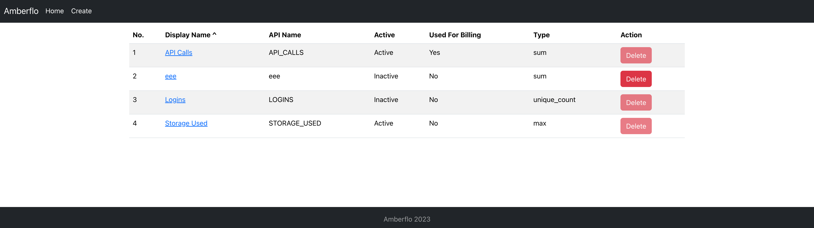
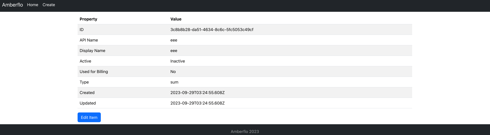
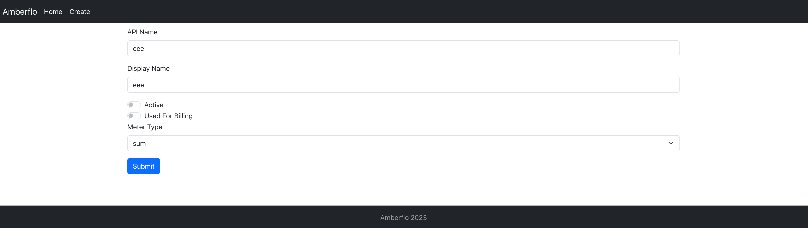

# Meter Management App

This project was bootstrapped with [Create React App](https://github.com/facebook/create-react-app).

## Getting Started

### Installation

- Install `nvm`
- Current Node version: `v16.15.1`
- Run `yarn install`
- Copy the `.env` file that includes `api key` and `api base url`
  

## Commands

### Common

- `yarn start`: Run a local dev server
- `yarn build`: Build the project

## Links

- Visit [localhost:3000](http://localhost:3000/)

## Screenshots

## Features

- List and sorting
- CRUD operation for `Meters`

## Tech stacks used

- `Creact React App` as a basic template
- `TypeScript` for type support
- `Reactstrap` and `Bootstrap` for styling
- `react-router-dom` for routing
- `prettier`, `eslint`, `stylelint`, `sort-import` for linting and code style fix
- `lint-staged`, `husky` for git hooks

## Todos

- Pagination
- Filter
- Searching
- Better responsiveness
- Notification & confirmation improvements
- Better error handling
- Testing
- More styling fixes
- etc.
